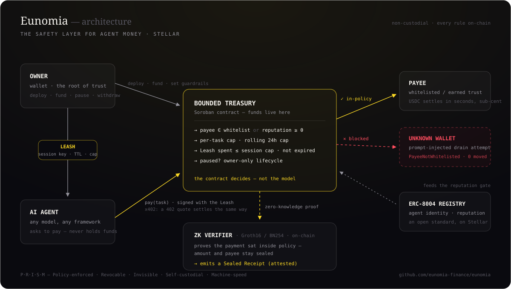
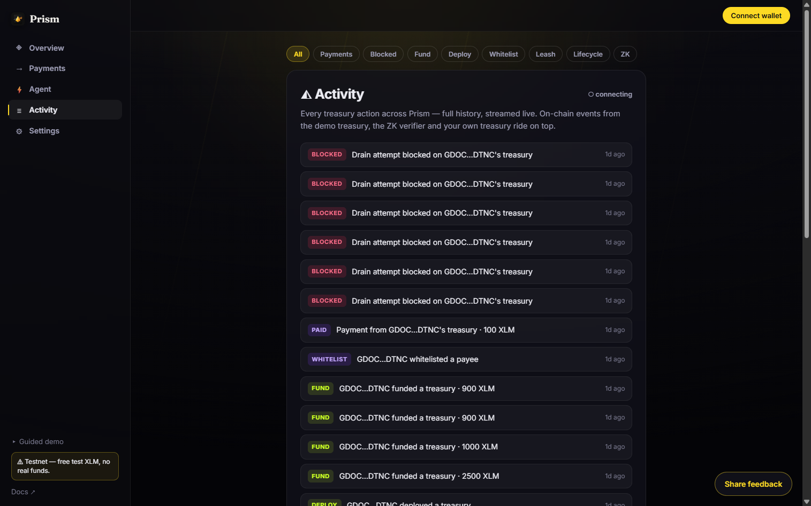

<div align="center">


# Eunomia

### The wallet your AI agent can't drain.

A non-custodial Soroban treasury that lets a business hand an autonomous AI agent **real money to spend** — where the **contract**, not the model's good behaviour, enforces the limits. Every payment is auto-accounted, and Stellar settles in sub-cents.

<sub>**Formerly PRISM** — renamed to Eunomia ahead of mainnet. All hackathon results, tester evidence and on-chain history in this repo refer to the same product.</sub>

[](https://github.com/Bekirerdem/prism/actions/workflows/ci.yml)


**[▶ Live demo](https://eunomia.finance) · [🎥 Demo video](https://youtu.be/R7mw9ZTh94U) · [🎤 Pitch deck](https://deck-bice-omega.vercel.app) · [🗺 Roadmap](ROADMAP.md) · [🔗 Contract on Stellar Expert](https://stellar.expert/explorer/testnet/contract/CAYWNXHANRY5GSJAZOR4YTKBKNOKTCITE52ZRKDKCAWLDTYWFFVFSPAZ) · [📄 Deployment & proofs](DEPLOYMENT.md)**


</div>

---

## The Eunomia framework (P·R·I·S·M)

> **A leash, not a wallet.** An agent spends on a **Leash** — scoped, expiring authority — never with the keys to the vault.

| | Guarantee | Meaning |
|---|---|---|
| **P** | Policy-enforced | Every spend passes the contract's rules — not the model's judgement. |
| **R** | Revocable | Leashes expire on their own; pause the agent or withdraw at any time. |
| **I** | Invisible | Amounts and payees proven in-policy — sealed, never disclosed. |
| **S** | Self-custodial | Funds live in the owner's contract. Never with us, never with the agent. |
| **M** | Machine-speed | Sub-cent, sub-5-second settlement on Stellar — x402-native. |

**Vocabulary:** a **Leash** is the time-bound, spend-capped session key an agent signs with; a **Sealed Receipt** is the on-chain ZK attestation (the `attested` event) proving a payment stayed in policy without revealing the amount or the payee.

---

## Architecture

<div align="center">

</div>

- **Owner** is the root of trust: deploys the treasury, funds it, sets the Guardrails, and can pause or withdraw at any time.
- **Agent** never holds funds — it holds a **Leash**: a time-bound, spend-capped, instantly revocable session key.
- **Treasury** (Soroban) enforces every rule on-chain: payee whitelist *or* earned ERC-8004 reputation, per-task cap, rolling 24h cap, Leash limits, pause state. An out-of-policy payment reverts — the demo shows a prompt-injected drain bouncing live.
- **ZK verifier** (Groth16/BN254) proves a payment sat inside policy without revealing the amount or the payee, and emits a **Sealed Receipt** — auditable, not disclosed.
- **x402**: when a service answers `402 Payment Required`, the quoted charge settles through the same policy gate — an over-limit or wrong-payee quote never reaches settlement.

---

## 🏆 Built during Stellar Hacks: Real-World ZK

Eunomia's bounded-treasury core predates this hackathon (built at IBW 2026). **Everything zero-knowledge — Eunomia's entire Confidential layer — was designed and built inside the Stellar Hacks: Real-World ZK window (June 18–22, 2026)**, and is the focus of this submission:

| Date | Built this hackathon |
|---|---|
| Jun 18 | Confidential ZK design spec |
| Jun 19 | Compliance **circuit** (Circom/BN254): per-task range + daily-sum bounds · `Poseidon` commitments · Poseidon-Merkle whitelist membership · Groth16 trusted setup (Hermez ptau) · **on-chain BN254 verifier + attestation** (`CCOLX7NE…`) |
| Jun 21 | **Hardened verifier** — anchored-policy binding + replay guard, with a live replay-rejected proof on testnet · CSPRNG commitment salt (closed a hiding break) |
| Jun 22 | **Confidential-mode demo** on the dashboard — commitments + proof + the live attested tx |

Also built in this window (the open-economy trust layer): reputation-gated payees, outcome-bound escrow, and the bounded x402 buyer. Every item is in the git history and verified on testnet (links throughout this README).

**Where the ZK is load-bearing** — a judge's map: the [Circom circuit](circuits/circuits/compliance.circom) proves per-task + daily bounds, Poseidon commitment binding, and Merkle whitelist membership; the [on-chain verifier](contracts/compliance_verifier/src/lib.rs) runs the real BN254 pairing check through Soroban's native host functions (Protocol 25 "X-Ray") and rejects any proof that doesn't match the owner's **anchored policy** or that **replays** an old period — a valid proof is the *only* way to produce a `ComplianceAttested` event. Proofs: [live verify tx](https://stellar.expert/explorer/testnet/tx/4438c94952d6d06fbf6b205e07be1c28ea33c5e1422a5323e93572788b9cac2a) · a live replay-**rejected** proof in [`DEPLOYMENT.md`](DEPLOYMENT.md). And since submissions opened, the treasury this layer attests over became a **live per-user product with real testnet users** ([roadmap](ROADMAP.md) · [security](SECURITY.md)).

---

## TL;DR

- **Bound** — the agent physically can't overspend or pay the wrong address; the contract rejects violations **on-chain**.
- **Account** — every payment is tracked per task in the contract, attributable with zero overhead.
- **Fund** — earmark a budget per agent via zero-cost Stellar **muxed sub-addresses** — no memos, no new accounts.
- **Trust + outcome** — pay any agent above an earned **reputation** threshold (not just a static whitelist), **escrow** funds for pay-on-delivery, and cap an agent's **x402** pay-per-use API spend.
- **Prove (ZK)** — confidential mode proves the agent stayed within policy in zero-knowledge, [verified on-chain](https://stellar.expert/explorer/testnet/tx/4438c94952d6d06fbf6b205e07be1c28ea33c5e1422a5323e93572788b9cac2a), revealing no amount or payee.
- **Live** — deployed on Stellar testnet, settling real on-chain payments and rejecting real exploits. The demo pays testnet USDC (a test-issued asset); the per-user product runs on native testnet XLM. Circle USDC is the mainnet path ([roadmap M3](ROADMAP.md)). `cargo test -p treasury` → **48/48**.

## The problem

AI agents can reason, plan, and act — right up until they need to **pay** for something. Today no business gives an LLM agent a wallet, for two reasons:

1. **Safety.** One hallucination, jailbreak, or prompt-injection and the wallet is drained.
2. **Accounting.** An agent that makes hundreds of small payments is impossible to reconcile.

So agents "research and recommend" but never actually transact. **Eunomia removes the blocker.**

## What Eunomia does

| | Guarantee | How |
|---|---|---|
| **Bound** | The agent can't overspend or pay the wrong address | Soroban contract enforces a policy (payee whitelist · per-task limit · daily limit) and **rejects violations on-chain** |
| **Account** | Every payment is attributable, with zero overhead | Spend is tracked **per task** in the contract; read straight off-chain |
| **Fund** | Earmark money for a specific agent budget with no memos | A pool account issues **zero-cost muxed sub-addresses**; deposits are attributed by `to_muxed_id` |
| **Trust** | The agent can pay *new* counterparties safely, not just a static list | Payee passes if **whitelisted OR** its on-chain ERC-8004 **reputation ≥ threshold** |
| **Outcome** | Pay only for delivered work | **Escrow** locks funds; released on approval, refunded after a deadline |

The business keeps custody the whole time — funds live in the owner's own Soroban contract. Eunomia is the **guardrails + accounting + rail**, never the custodian.

## How it works

The agent signs its own `pay(task, to, amount)`. The contract runs the policy gate, in order, on **every** call:

```
1. spender.require_auth()            the active session agent — else the root agent
2. not paused                        else  Paused               (#9)
3. amount > 0                        else  InvalidAmount        (#1)
4. payee whitelisted OR reputation≥min  else  PayeeNotWhitelisted / BelowReputation (#2/#5)
5. amount ≤ per-task limit           else  ExceedsTaskLimit     (#3)
6. session spent + amount ≤ session cap  else  ExceedsSessionLimit (#10)
7. rolling-24h spend + amount ≤ daily limit  else  ExceedsDailyLimit (#4)
8. amount ≤ balance − escrow-locked  else  InsufficientFreeBalance (#6)
9. record spend, THEN transfer       (checks-effects-interactions — reverts atomically)
```

A prompt-injected "drain to attacker" payment is signed by the agent and still **bounces** at step 4 — funds never move. And even a fully **leaked session key** is bounded: its cap (#10), the rolling window (#4), expiry, and instant revocation contain the blast radius.

```
          fund (muxed M-addr, per budget)            agent pays vendor (USDC)
   client ───────────────► POOL (G) ──► owner    AGENT ──► [ pay(task,to,amt) ]
                            to_muxed_id            (signs)         │
                            attribution                            ▼
                                                  ┌──────────────────────────────┐
                                                  │  EUNOMIA TREASURY (Soroban)   │
                                                  │  • policy: whitelist / per-   │
                                                  │    task / daily limit         │
                                                  │  • rejects violations on-chain│
                                                  │  • per-task accounting + event│
                                                  │  USDC stays here (owner's)    │
                                                  └──────────────┬───────────────┘
                                                                 ▼  USDC transfer
                                                              VENDOR
   trust layer:  ERC-8004 identity + reputation-gated payees (live) · escrow · x402  ·  trionlabs/stellar-8004
```

## Confidential mode — same guarantees, zero disclosure (ZK)

Eunomia's policy gate is transparent: today every `pay` reveals the payee and amount on-chain. **Eunomia Confidential** adds a zero-knowledge layer so a business can *prove its agent obeyed policy without revealing what it spent, on what, or with whom.*

Each payment is hidden behind a commitment `C = Poseidon(amount, payee, salt)`. A single **Groth16 proof — verified on-chain by a Soroban contract** — attests over a batch that:

```
∀i  amount_i ≤ per-task limit        (range proof)
    Σ amount_i ≤ daily limit         (aggregate bound)
∀i  payee_i ∈ whitelist              (Poseidon Merkle membership)
∀i  C_i = Poseidon(amount_i, payee_i, salt_i)   (commitment binding)
```

No amount or payee is ever revealed — only the commitments and the proof go on-chain. The contract runs the BN254 pairing check and emits `ComplianceAttested(whitelist_root, period_id)`. **Verified live on testnet:** [on-chain verify tx](https://stellar.expert/explorer/testnet/tx/4438c94952d6d06fbf6b205e07be1c28ea33c5e1422a5323e93572788b9cac2a) · verifier [`CCOLX7NE…DBRH`](https://stellar.expert/explorer/testnet/contract/CCOLX7NEBDJRRVTPFVSK3UJLHMG3HO4UVYJW3NFBOTUG7Q7GOP63DBRH).

- **Circuit** — Circom (BN254), `circomlib` Poseidon + Merkle + range proof. `npm test` in `circuits/` → **6/6**.
- **On-chain verifier** — `soroban-verifier-gen --curve bn254`, wrapped with a raw-bytes ABI + **anchored-policy binding + replay guard** + attestation event. `cargo test -p compliance_verifier` → **4/4**.
- **Proving** — snarkjs Groth16 over the public Hermez powers-of-tau; off-chain `snarkjs verify` is the documented fallback.

> **Honesty note & how it composes.** Eunomia's ZK hides the *compliance ledger* — storage and events carry only commitments and a proof, never plaintext amounts or payees. **Transfer-level privacy** (hiding the USDC movement at the token layer) is a *complementary* layer, and it's exactly what [OpenZeppelin + SDF's **Confidential Tokens**](https://github.com/OpenZeppelin/stellar-contracts/tree/feat/confidential-verifier-ultrahonk) deliver — SEP-41 balances as Grumpkin/Pedersen commitments with on-chain UltraHonk proofs. The two layers slot together cleanly: their token exposes a **`ComplianceHooks` (external policy)** extension point, and Eunomia's bounded policy (per-task / daily / whitelist) is precisely the policy that plugs into it — *confidential token + bounded-agent compliance*. So Eunomia proves **the agent obeyed policy** while a Confidential Token hides **the amounts**. For this demo, real fund movement is shown in the contrasting transparent "public mode"; pairing with a Confidential Token is the integration path (their preview is testnet-only / unaudited).

## Trust, outcomes & x402

Three upgrades take Eunomia from a walled garden to the open agent economy — each enforced by the same contract, all live on testnet ([proofs](DEPLOYMENT.md)).

- **Reputation-gated payees.** The payee gate is no longer a static whitelist: a payment clears if the payee is whitelisted **OR** its on-chain reputation ≥ a threshold the owner sets — so an agent can safely pay *new* counterparties it was never pre-approved for. Reputation is read cross-contract from an ERC-8004-style registry. [Live: a non-whitelisted reputable payee paid on-chain](https://stellar.expert/explorer/testnet/tx/8d62132f4940f71758a351e68c8a7fe0f24b14207abf8c9c3eed6b3842c215cb).
- **Escrow (pay-on-delivery).** `create_escrow` locks funds for a payee against a task — reserved in the treasury, not moved. The owner `release`s them on approval (daily limit + accounting applied at the real outflow), or the agent `refund`s after a deadline (the lock returns to the free balance, nothing paid). [Live: release](https://stellar.expert/explorer/testnet/tx/df742d987d85efb517a164b68e36c9302c4daf623c15dcaf416c73cbb26f6c4b) · [refund](https://stellar.expert/explorer/testnet/tx/b545aeb489e8e36f73b195f299b5926f2387979cd71701bb428a8b099a718e46).
- **Bounded x402.** When an agent hits an [x402](https://developers.stellar.org/docs/build/agentic-payments/x402) `402 Payment Required`, `packages/x402` gates the payment against the treasury policy first and only settles through the bounded treasury's `pay()` if it passes — the agent can't be tricked into an over-limit or wrong-payee x402 payment. [Live: an in-policy x402 payment settled on-chain](https://stellar.expert/explorer/testnet/tx/8a1a887ac32b700d7e2ad2d28d64760003529c8d804be600891b162eba8ada1a); an over-limit one is gated off-chain before it ever reaches `pay()`. `npm test` → **11/11**.

`cargo test -p treasury` → **48/48** (core + reputation + escrow + hardening + M2: agent sessions, lifecycle, and the rolling 24h window — including the `c2_day_boundary_no_longer_doubles` proof).

## Why Stellar

- **Sub-cent, deterministic fees** make agent micro-payments economical (gas would kill this).
- **Muxed accounts** — one account, infinite zero-cost sub-addresses — are the attribution primitive for swarms of agent payments. No equivalent is this cheap elsewhere.
- **Native account abstraction** (`__check_auth`) makes a contract-bounded agent first-class.
- **Native USDC** + path-payment + anchors connect the agent to the real world.

## Try the live demo

**→ [prism-stellar.vercel.app](https://prism-stellar.vercel.app)** (Stellar testnet, no wallet needed)

1. **Run agent tasks** — the agent autonomously settles 3 vendor payments in USDC. No wallet popup; it signs its own transactions. Each lands with a real Stellar Expert tx link.
2. **Simulate prompt-injection** — tell the agent to send funds to an unapproved wallet. The contract **rejects it on-chain** (`PayeeNotWhitelisted`). Funds never move. 🔴
3. **Confidential mode (ZK)** — the same payments shown as `Poseidon` commitments: amount and payee hidden, yet proven within policy and **attested on-chain** (live verify tx). 🔒
4. **Auto-reconciled spend** — per-task accounting, read straight from the contract.
5. **Funding rail** — fund a budget via its zero-cost muxed sub-address; the deposit is attributed on-chain with no memo.

## Use your own treasury (per-user product)

Beyond the spectator demo, **connect a wallet and run your own** bounded treasury — [open the app](https://prism-stellar.vercel.app) and pick **Open app**. Quickstart guides: [English](docs/TRY-IT.md) · [Türkçe](docs/TRY-IT-TR.md).

1. **Install a Stellar wallet** — e.g. [Freighter](https://www.freighter.app/), switched to **Testnet** in its settings.
2. **Connect** — any Stellar wallet, testnet.
3. **Get free testnet XLM** — a fresh wallet has 0 XLM; the app detects it and offers one-click [friendbot](https://friendbot.stellar.org) funding. (Per-user treasuries run on native testnet XLM; the USDC rail is the spectator demo.)
4. **Create treasury** — set your daily + per-payment limits; the contract deploys with you as owner (`admin = agent = your wallet`, non-custodial). **Copy your treasury ID** (the "Copy ID" button) and keep it — it's how you reopen the treasury from another browser or device.
5. **Fund** it with testnet XLM from your wallet.
6. **Whitelist** the payees your agent may pay — no second address handy? the app offers a sample vendor to whitelist.
7. **Spend** — in-policy payments settle on-chain; anything over a limit or to a non-whitelisted payee is **rejected by the contract** (`ExceedsTaskLimit` / `PayeeNotWhitelisted`), funds never move. The rejection is the product working.
8. **Analytics & monitoring** — payment count, total spent, policy violations, and runtime errors, read from your treasury's on-chain events.

Every action is signed by your own wallet — non-custodial end to end. Feedback via the **Share feedback** button (a short Google Form) steers the roadmap.

## Live on testnet

| Contract | Address |
|---|---|
| Eunomia Treasury | [`CAYWNXHA…SPAZ`](https://stellar.expert/explorer/testnet/contract/CAYWNXHANRY5GSJAZOR4YTKBKNOKTCITE52ZRKDKCAWLDTYWFFVFSPAZ) |
| USDC (SAC) | [`CDCEHPK4…3Y2W`](https://stellar.expert/explorer/testnet/contract/CDCEHPK4OJXVRA4JV7N56GR5SRD5KGGZ55BDSHKODGR72Y4KGS6A3Y2W) |
| Funding pool | [`GD2NZKSM…3427`](https://stellar.expert/explorer/testnet/contract/GD2NZKSMQW367OIFXRM4NP7RIW6YLDZLJ4C7253MDOKCFC4Q4IOO3427) |
| ERC-8004 Identity Registry | [`CDE3K4CO…FIWZH`](https://stellar.expert/explorer/testnet/contract/CDE3K4COIAGWNNJQQLL26SYI3KBJF5FUDHXG5FA6GYDJCG7T5V7FIWZH) — agent #1 registered |
| **Treasury v2** (reputation + escrow) | [`CDKQGDPL…XT5H`](https://stellar.expert/explorer/testnet/contract/CDKQGDPLRX6DOCQTI5KVMZNGMPKMSRNGJRVCQ7LAAQGB2S5JKDCHXT5H) |
| **Compliance Verifier** (ZK) | [`CCOLX7NE…DBRH`](https://stellar.expert/explorer/testnet/contract/CCOLX7NEBDJRRVTPFVSK3UJLHMG3HO4UVYJW3NFBOTUG7Q7GOP63DBRH) |
| Reputation Oracle (8004 stand-in) | [`CCJFIEYF…INKY`](https://stellar.expert/explorer/testnet/contract/CCJFIEYFNPRTJVCOGOSESYC5Z6FHHHYAH36V7QTZEDPKESY6O5TPINKY) |
| **Eunomia Policy** (OZ Confidential Token `ComplianceHooks`) | [`CBWMYGL7…BLQF`](https://stellar.expert/explorer/testnet/contract/CBWMYGL7E663UON6ER5KQX2JZZA4UDZZD4RIFEHGXXF2HMMBRAN7BLQF) — `is_authorized` live |

The first treasury is the transparent "public mode" demo; **Treasury v2** adds the reputation gate + escrow. Full addresses + verified on-chain results: [`DEPLOYMENT.md`](DEPLOYMENT.md).

## Testers & traction

Eunomia is used by people who are not us. Every treasury below was deployed by someone
connecting their own Stellar wallet on testnet — no seeded accounts, no scripted users.

Counts below are what **testers** did — our own testing is excluded and shown separately,
so the numbers reconcile against the two sources named underneath.

| | On testnet, as of 28 Jul 2026 |
|---|---|
| External testers | **14** — 12 with on-chain proof, 2 who explored and reported back |
| Treasuries deployed by testers | **13** (15 including ours) |
| Funding & payment transactions | **19** by testers (28 including ours), each recorded with its tx hash |
| Payments **blocked by the contract** | **13** by testers (20 including ours) — over-limit or non-whitelisted, funds never moved |
| Wallet connections | 36 successful sessions (29 desktop · 7 mobile via WalletConnect) |

Usage is provable from two independent sources, neither of which we can quietly edit:
the **on-chain [TreasuryRegistry](https://stellar.expert/explorer/testnet/contract/CBEPVXK6BN2FZ3IYHV5KQUGROFHNBWBYHKHRZ5U3O7UWGIOPFOFE4ZE7)**,
where each deploy registers its owner wallet, and a telemetry table recording every treasury
action with its tx hash. Both are reconciled by [`web/scripts/user-count.mjs`](web/scripts/user-count.mjs)
into [`docs/metrics/registered-users.json`](docs/metrics/registered-users.json) — a cumulative
snapshot of owner wallets and the treasuries they deployed, checked into the repo. Every tx
hash opens in Stellar Expert and settles.

Rejections are the interesting half: 13 tester attempts hit the policy gate and reverted.
That is the product working, not failing.

### Feedback & how we act on it

Structured feedback comes through a **[Google Form](https://forms.gle/7gzJWwte52SmbXei7)** —
name, email, Stellar wallet, rating, most-valuable feature, production intent, improvements —
flowing to a private review sheet (wallet/email kept private; only aggregates are shared here).

**Signal from 11 external responses:** **4.9 / 5** average · **7 yes / 4 maybe** on *would you
use this in production*, none said no · most-valued features split between the **bounded
treasury** (5), **confidential mode (ZK)** (4) and **x402 agentic payments** (2).

**What testers hit → what we shipped:**

| Feedback | What we shipped | Commit |
|---|---|---|
| Zero-balance first-timers stalled before any action — no way to get testnet XLM | Funding gate + one-tap friendbot button + balance check | [`3b32062`](https://github.com/Bekirerdem/prism/commit/3b32062) |
| The treasury contract ID was easy to lose after deploy | "Copy ID" + save reminder + StrKey validation | [`19d563c`](https://github.com/Bekirerdem/prism/commit/19d563c) |
| First run was unclear — *what do I whitelist / pay?* | "Use the sample vendor" prefill + whitelist→spend autofill + human-readable errors | [`c0c3680`](https://github.com/Bekirerdem/prism/commit/c0c3680) |
| Mobile visitors couldn't see the nav | Compact, responsive mobile nav | [`528d22d`](https://github.com/Bekirerdem/prism/commit/528d22d) |
| *"UX is kinda cluttered"* · *"maybe work on user flow"* | Full app shell — five sections, sidebar on desktop, bottom tabs on mobile, one job per screen | [`074a76c`](https://github.com/Bekirerdem/prism/commit/074a76c) |
| *"multi wallet"* — testers ran more than one treasury | Treasury switcher + "New treasury", with cross-device recovery from the on-chain registry | [`9f798a0`](https://github.com/Bekirerdem/prism/commit/9f798a0) |
| *"'how it works' isnt functioning"* | Landing anchors no longer swallowed by the hash router | [`cba88a4`](https://github.com/Bekirerdem/prism/commit/cba88a4) |
| *"more agent action options"* · *"openclaw skills"* | On the roadmap → agent tooling / MCP + stellar-8004 ([`ROADMAP.md`](ROADMAP.md) M2/M4) | |

**Tried Eunomia?** Tell us what to fix next: **[share feedback →](https://forms.gle/7gzJWwte52SmbXei7)**

## Quickstart

```bash
# 1. Contract — test & build (already deployed; this is optional)
cargo test  --manifest-path contracts/treasury/Cargo.toml   # 48/48 passing
stellar contract build --manifest-path contracts/treasury/Cargo.toml

# 2. Frontend — landing + live dashboard
cd web
npm install
npm run dev        # opens on http://localhost:5173 (or the next free port)
```

The dashboard reads live testnet state, and the embedded agent key (testnet-only, zero value) lets the agent sign its own payments — that's the whole point: **the contract is the safety, not a human clicking approve.** A build-time guard refuses to load the bundled key on any non-testnet network.

### Screenshots

**Your own treasury (per-user product)** — connect a wallet, deploy your own bounded treasury, fund it, whitelist payees, spend within policy. The app shell splits that into five sections (Overview · Payments · Agent · Activity · Settings); **Activity** is the live platform feed, every row a real tester's on-chain action — including the drain attempts the contract turned down:



**The agent dashboard — an AI agent spent real money, safely** (treasury balance, per-task & daily limits, live on-chain settlement):


**Confidential mode · zero-knowledge** — every settled payment is proven inside policy without revealing any amount or payee (Poseidon commitments + on-chain BN254 attestation):


**Mobile responsive** (390 px) — the sidebar becomes bottom tabs, and mobile wallets connect over WalletConnect:


**Continuous integration** — every push runs three jobs: Soroban contracts (`cargo test`), frontend (Vitest + build), and the x402 + prover package tests.


## Project structure

```
contracts/treasury/             Soroban bounded treasury v3 — policy gate + escrow + agent sessions + lifecycle + rolling 24h window (+ 48 tests)
contracts/compliance_verifier/  on-chain BN254 Groth16 verifier (ZK) + attestation (+ 4 tests)
contracts/reputation_oracle/    ERC-8004-style reputation registry (stellar-8004 stand-in)
contracts/treasury_registry/    permissionless wallet → treasury discovery index (cross-device recovery)
circuits/                       Circom compliance circuit + circomkit tests + trusted setup
packages/treasury-client/       generated TypeScript client (regen: `npm run generate`)
packages/registry-client/       generated TypeScript client for the treasury registry
packages/prover/                snarkjs → Soroban byte encoder + proof fixtures
packages/x402/                  bounded x402 buyer (gate an x402 payment, settle via the treasury)
web/                            landing + live dashboard (Vite · React 19 · TS)
deck/                           pitch deck (self-contained spectral slides)
DEPLOYMENT.md                   live testnet addresses & verified results
docs/                           narrative + assets, design spec & plan
```

## Tech stack

- **Contract:** Rust / `soroban-sdk` 26 (Soroban, Stellar testnet)
- **Confidential (ZK):** Circom + `circomlib` (BN254) · snarkjs Groth16 · on-chain verifier via `soroban-verifier-gen` (`bn254_multi_pairing_check`)
- **Client:** `stellar contract bindings typescript` → typed client
- **Frontend:** Vite + React 19 + TypeScript, framer-motion, cinematic dark design (Stellar-yellow accent)
- **Trust + rails:** ERC-8004 agent identity + **reputation-gated payees (live)** ([trionlabs/stellar-8004](https://stellar.expert/explorer/testnet/contract/CDE3K4COIAGWNNJQQLL26SYI3KBJF5FUDHXG5FA6GYDJCG7T5V7FIWZH) in production; a stand-in oracle on testnet); **escrow** for pay-on-delivery; a **bounded x402** buyer that caps an agent's pay-per-use API spend.

## Security

- **Non-custodial** — funds never leave the owner's own contract; Eunomia cannot move funds outside the policy.
- **Checks-effects-interactions** — accounting is written before the transfer, so a failed/reentrant transfer reverts the whole call atomically.
- **No front-runnable init** — the policy is set atomically in the constructor at deploy time.
- **Testnet-only key** — the demo's embedded agent key holds no real value, and a config guard blocks loading it on any non-testnet network.

Full security model, audit-finding status, known limitations, and how to report a vulnerability: [`SECURITY.md`](SECURITY.md).

## Team

- **Bekir Erdem** — contract & engine (the Soroban treasury and core).
- **Seyit Ali Değirmen** — money system & the screen (muxed funding rail + UX).

## License

[MIT](LICENSE) © 2026 Bekir Erdem · Seyit Ali Değirmen
